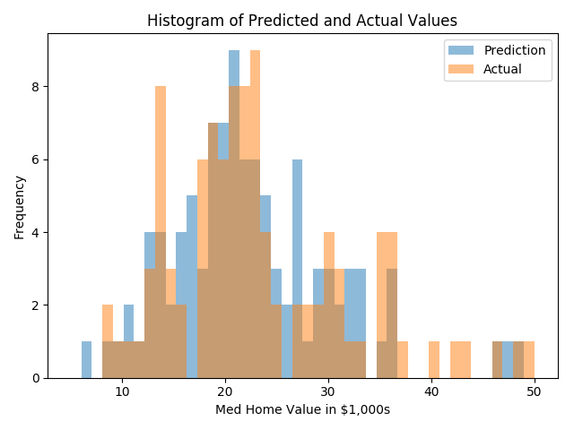
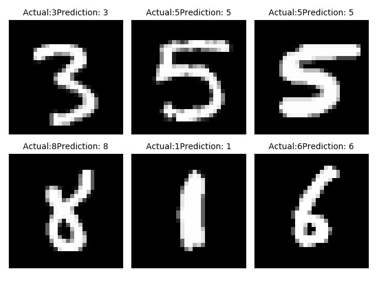

## Chapter 5: Nearest Neighbor Methods  

This chapter will focus on nearest neighbor methods and how to implement them in TensorFlow.

* Working with Nearest Neighbor  

We will use the Boston housing datasets and be predicting the median neighborhood housing value as a function of several features. We will find the k-NNs to the prediction points and do a weightd average of the target value.

Here is the histogram of predicted and actual values:  

* Working with Text-Based Distances

We implement the Nearest Neighbor method based on text-based distances with TensorFlow. The text-based distance is the **Levenshtein distance(the edit distance)** between strings. The levenshtein distance is the minimal number of edits to get from one string to another string. The allowed edits are inserting a character, deleting a character, or substituting a character with a different one.

* Computing with Mixed Distance Functions  

It is important to extend the nearest neighbor algorithm to take into account variables that are scaled differently. Here we will show how to scale the distance funtion for different variables. The key to weighting the distance function is to use a weight diagonal weight matrix.

Here is the histograms of the predicted and actual housing values on the Boston dataset.

* Using an Address Matching Example

Combining distances between observations that have both text and numerical feature. And we will match the non-typo addresses with actual street addresses.

Here are the results of 10 test addresses.

* Using Nearest Neighbor for Image Recognition  

We use the MNIST dataset for image recognition. And it's composed of thousands of labeled images that are 28*28 pexels in size. And we could compare the results to a neural network in the later chapter. We import the Python Image Library to be able to plot a sample of the predicted outputs.  

Here are the predictions of last batch.

