## Chapter 6 Nerual Network

* **Implement Operational Gates**

The first operational gate we will implement looks like f(x)=ax. And the second operational gate will be f(x)=ax+b. Here a and b are varables, and x is a placeholder. We optimize the output toward the target value of 50, which means tensorflow will try to change the a and b values instead of x value. In the second example, the solution is not unique as there are diffferent comnination od model variables. 

And here are the training variables' values:
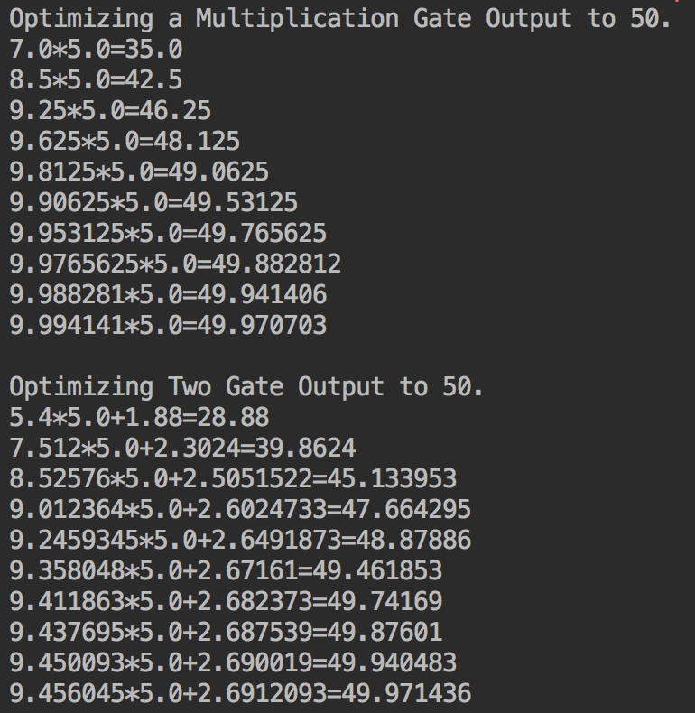

* **Working with Gates and Activation Functions**

As we could link together operational gates, here we will try to run the computational graph output through an activation function. And we mention 2 activations, the sigmoid and the rectified linear unit(ReLU). So we create 2 one-layer neural network with the same structure except one feed through the sigmoid activation and one will feed through the ReLU activation. The loss function is the L2 distance from the value 0.75. The data will be randomly selected from a normal distribution(N(2,0.1)).  

Here are the Activation output and loss values of 2 neural networks during the training:

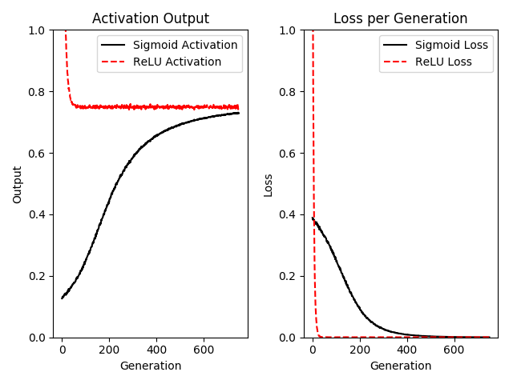

* **Implement a One-Layer Neural Network**

Here is a one-layer neural network that operates on the iris dataset. In the problem, we use the pedal length as the target value. So it is a regression problem. 

The following is the loss during the training:

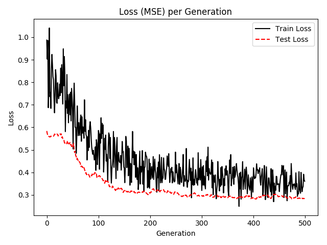

Note: In the book, the author set the hidden layer to have 5 nodes, which should be not enough to fit the regression variables. When I change it to 10, to some extent, the underfitting was eliminated.

* **Implement Different Layers**

In the recipe, we create and use convolutional and maxpool layers wigh input data and with fully connected data. And we build two part, one for one-dimensional data and one for two-dimensional data. Those data are obtained from normal distribution.

Here are the details and outputs for these neural networks:

One-dimensional Data:

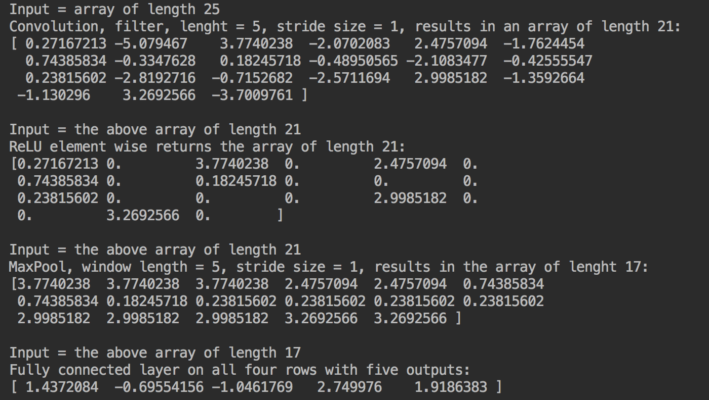

Two-dimensional Data:

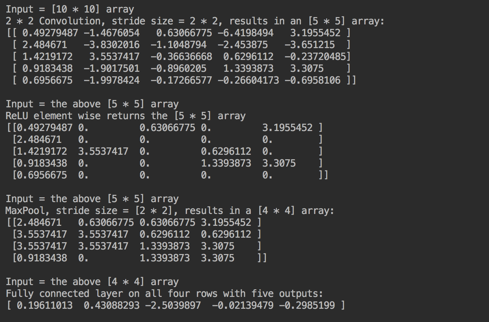

* Using Multilayer Neural Networks

In the recipe, we use a multilayer neural network to predict birthweight in the Low Birthweight dataset. The model we are using has 522 variables to fit, which is significant larger than the nine variables that we used in logistic regression model. And here we also use different optimizer function, called Adam optimization, which affects the speed of convergence.

And these are the loss values during the training process:

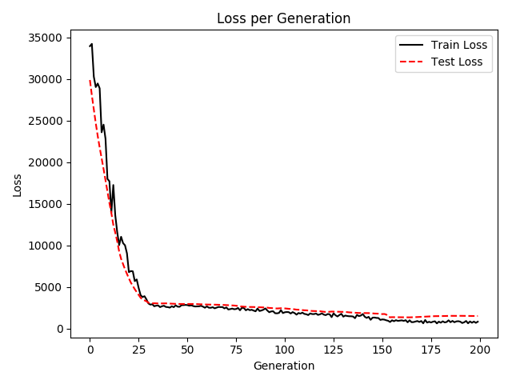

Besides, the Loss and Acccuracy of the model is:

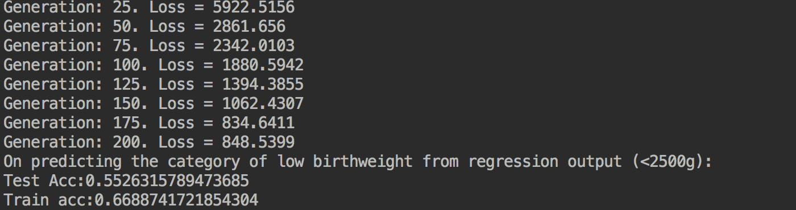

* Improving the Predictions of Linear Models

n the recipe, we will attempt to improve the logistic model of low birthweight with using a neural network. While the model has converged faster than prior models and is maybe a bit more accurate in some case, this comes with a price: we are training many more model variables and have a great chance of overfitting. 

> To see overfitting occurring, the accuracy of training set continues to increase slightly, while the accuracy on the test set stays the same or even decreases slightly. 
>
>To combat underfitting, we can increase the model depth or trian the model for more iterations. To address overfitting, we can add more data or add regularization techniques to the model.

The following are the plots of training loss value and accuracy of train and test sets:

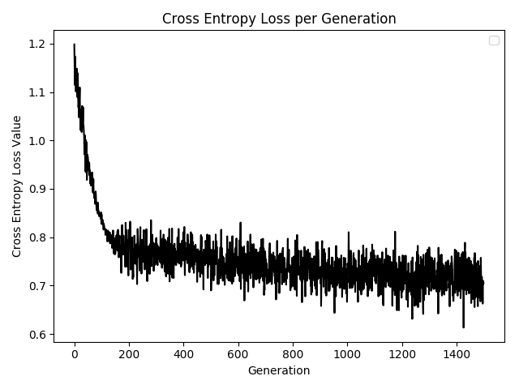

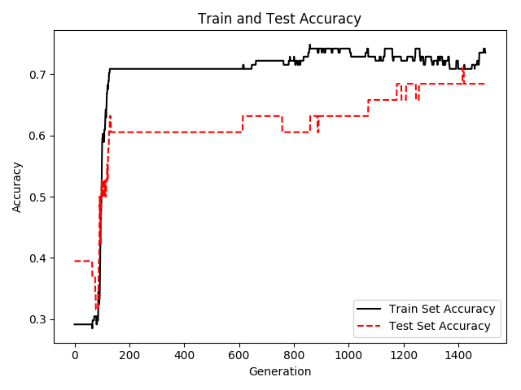

* Learning to Play Tic Tac Toe

In the recipe, we will try to use a neural network to learn the optimal response for a number of different boards. The reason is that the game is a deterministic game and the optimal moves are already known.

And here is the plot of loss values during training:

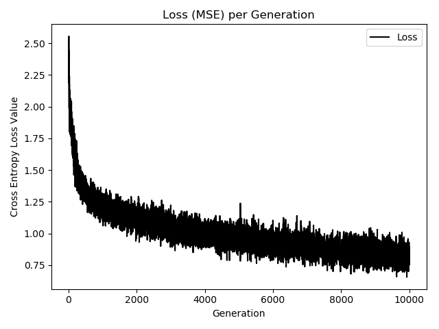

And the code also has bugs because there are problems with checking if the game ends:

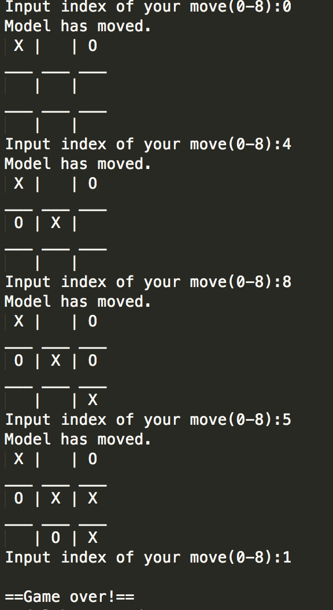