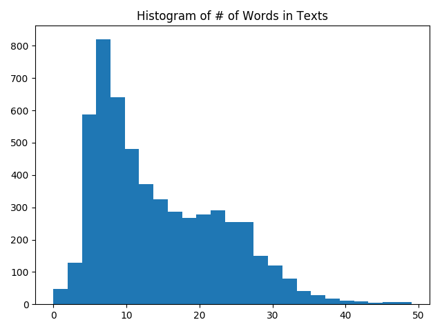

## Chapter 7 Natural Language Processing

* Working with bag of words

In the recipe, the code shows how to work with a bag of words embedding in TensorFLow. We will use this type of embedding to do spam prediction. We used TensorFlow's vocabulary processing functions to create a standardized vocabulary to work with and created sentence vectors which were the sum of each text's word vector.

Here is the histogram of Words in Text:

> Note: In the example, the limitation on the text size also limits the effect of text length on the prediction. Such imbalanced target data are heavily skewed toward words represented in ham part of the data. 