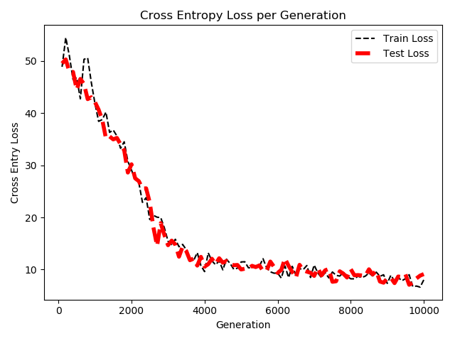

## Chapter 7 Natural Language Processing

* Working with bag of words

In the recipe, the code shows how to work with a bag of words embedding in TensorFLow. We will use this type of embedding to do spam prediction. We used TensorFlow's vocabulary processing functions to create a standardized vocabulary to work with and created sentence vectors which were the sum of each text's word vector.

Here is the histogram of Words in Text:

> Note: In the example, the limitation on the text size also limits the effect of text length on the prediction. Such imbalanced target data are heavily skewed toward words represented in ham part of the data. 

* Implement TF-IDF

In spam prediction, since we can choose the embedding for each word, we might decide to change the weighting on certain words. One strategy is to upweight useful words and downweight overly common or too rare words. TF-IDF is an acronym that stands for Text Frequency-Inverse Document Frequency. Here we take into consideration the word frequency.

Here is the loss and accuracy values during the training:

* Working with Skip-gram Embedding

In the recipe, we consider the order of words in creating word embedding. The first method we will explore is called skip-gram embedding. In 2013, Tomas Mikolov ang other researchers at Google authored a paper about creating word embeddings that addresses this issue, and they named their method Word2vec. The basic idea is to create word embedding that capture the relational aspect of words. And a neural network is used to predict surrounding words giving an input word.

Here is the training set accuracy:

* Working with CBOW Embedding

CBOW method of word2vec is about predicting a single target word from a surrounding window of context words.

* Making Predictions with Word2vec

In the recipe, the prior-trained embeddings to perform sentiment analysis by training a logistic linear model to predict a good or bad movie review.

This is the train loss and accuracy:

* Using Doc2vec for Sentiment Analysis

In this part, we extend the methodologies of train word embeddings to have a document embeddings. And it should capture the relationship of words to the document that they come from. Doc2vec simply adds an additional embedding matrix for the documents and uses a window of words to plus the document index to predict the next word. In the recipe, we concatenate the document embeddings to the end of the word embeddings.

The same as previous procedure, firstly, we create and save Doc2vec embeddings. Secondly, we use them to make sentiment predictions on the movie dataset.

The following figure is the loss during create and save the embeddings:

Here are the loss values for training and test the logistic regression model to make predictions:

And this is the accuracy on the train and test set. Compared with the Word2vec, the accuracy shows that Doc2vec have better performance.

