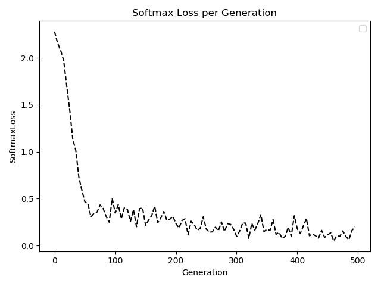
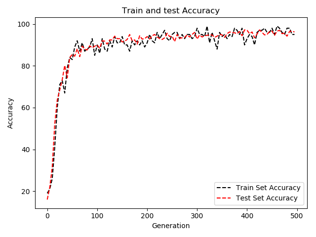
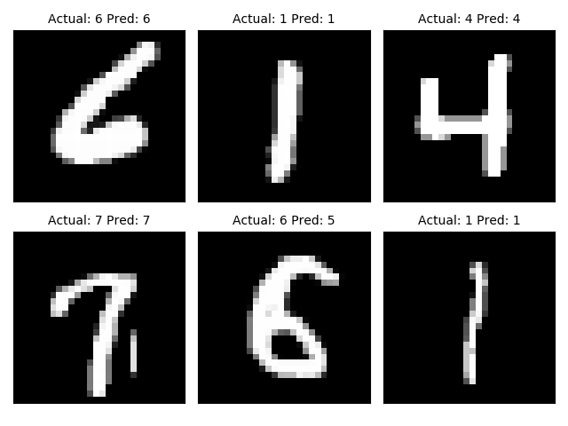
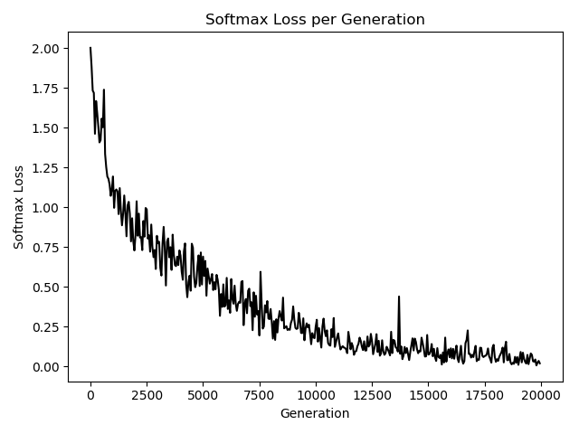
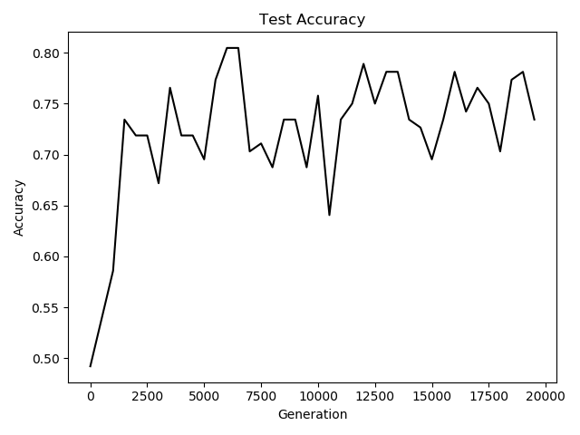

## Chapter 8 Convolutional Neural Network

* Implement A Simpler CNN

Here a four-layer convolutionql neural network will be developed to improve upon the accuracy in predicting the MNIST digits.

This is the softmax loss values during the training:

This is the Test Accuracy on MNIST per Generation:

 

This is the last batch for model to predict:

* Implement an Advanced CNN

In the recipe, a more advanced method of reading image data and a larger CNN to do image recognition on the CIFAR10 dataset will be implemented. The dataset has 60000 32*32 images that fall into exactly one of tem possible classes. The potential classes are airplane, automobile, bird, cat, deer, dog, frog, horse, ship, and truck.

Most of images datasets will be too large to fit into memory, so we can do with Tensorflow and set up an image pipeline to read in a batch at a time from a file. We set up an image reader and then create a batch queue taht operates on the image reader.

This is the loss values during the training:

This is the Accuracy of test set:

* Retraining Exist CNNs models

In this recipe, we will show how to use a pre-trained TensorFlow image recognition model and fine-tune it to work on a different set of images.