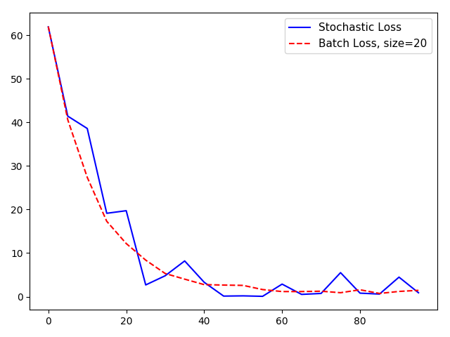
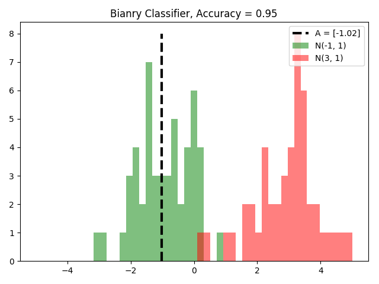

## Chapter 2: The TensorFlow Way 

* Operating in a Computational Graph
* Layering Nested Operations
* Working with Multiple Layers
* Implementing **Loss Functions**
* Implementing **Back Propagation**
* Working with **Batch and Stochastic Training**  
Extend the prior regression example using stochastic training to batch training. Stocahstic training is only putting through one randomly sampled data-target pair at a time. Batch training is putting a large protion of the training examples in at a time and average the loss for the gradient calculation.In stochastic training, randomness may help move out of local minimums. But it needs more iterations to converge. However, batch training finds minimums quicker and takes more resources to compute.  

Here's the loss vaules during the two training process.  
   
* Combining Everything Together  

We create a classifier on the iris dataset by combining everything together. It's a binary classifier to predict whether a flower is the species Iris setosa or not. Here we define the linear model. The model will take the form ***x2=x1\*A+b***. And if we want to find points above or below that line, we see whether they are above or below zore when plugged into the equation ***x2-x1\*A-b***.  

Here is the figure for the problem.  

* **Evaluating Models**  
Here is that we visualize the model and data with two separate histograms using matplotlib:
 