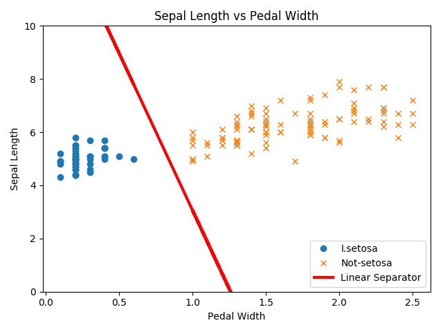
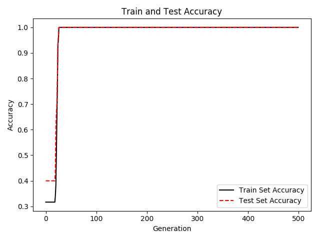
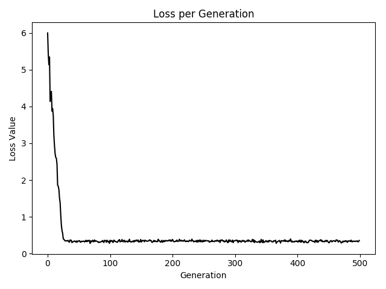

## Chapter 4: Support Vector Machines
* Working with a Linear SVM  

The basic idea is to find a linear separating line(or hyperplane) between the two classes. Here we create a linear separable binary data set for predicting if a flower is I.setosa or not.  

Here are the results of the classification.  

  

   
 

