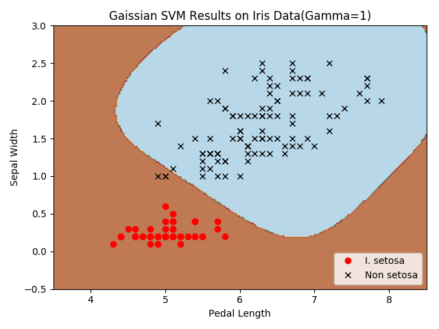
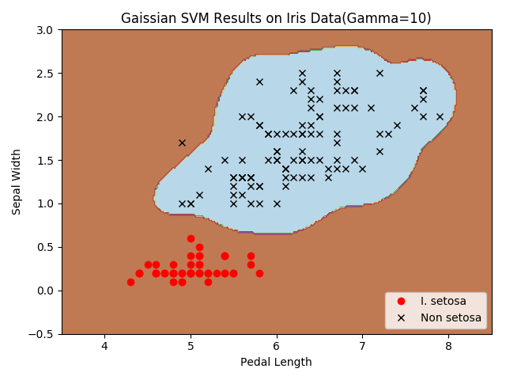
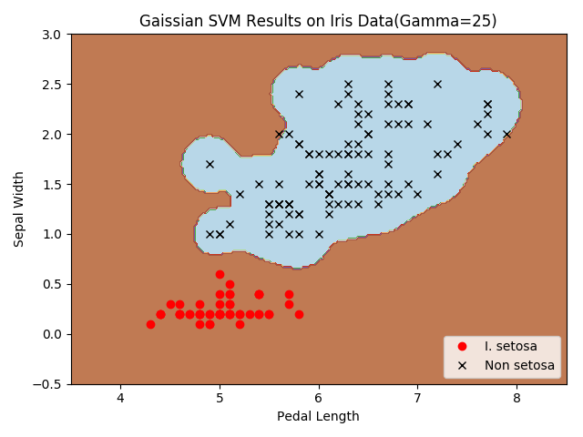
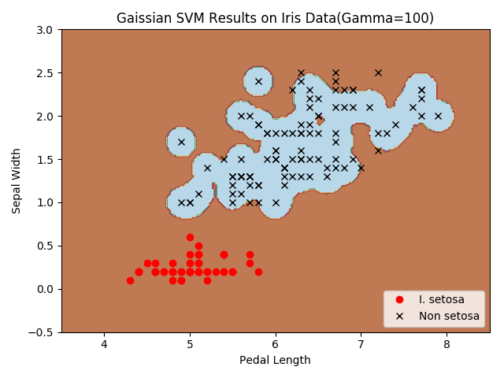
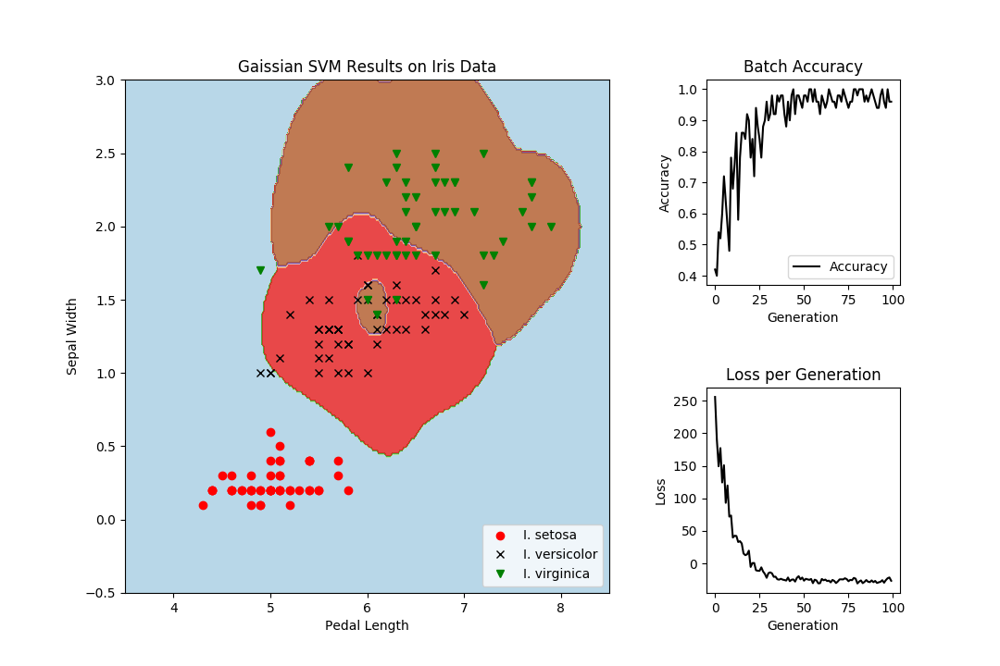

## Chapter 4: Support Vector Machines
* Working with a Linear SVM  

The basic idea is to find a linear separating line(or hyperplane) between the two classes. Here we create a linear separable binary data set for predicting if a flower is I.setosa or not.  

Here are the results of the classification.  

  

   
 

* Reduction to Linear Regression

We use the concept that maximizing the margin that contains the most (x,y) points to fit a line between sepal lenght and petal width in Iris dataset. The corresponding loss function will be similar to max(0, |yi - (Axi + b)|-ε). Here, ε is half of the width of the margin, which makes the loss equal to zero if a point lies in this region.

The best fit line and loss value during the iteration are showing in the following figures.  

  

* Working With Kernels 

The prior SVMs worked with linear separable data. If we would like to separate non-linear data, we can change how we project the linear separator onto the data. This is done by changing the kernel in the SVM loss function. And we implement the Gaussian kernel here.  

For the parameter set in the recipe, I find out that the iteration times might be a little bit small. So I increase the iteration from 500 to 1500. And here are the changes with different parameters.  

  

  

* Implement a Non-Linear SVM

We  apply a non-linear kernel to split the iris dataset. And the kernel is dependent on the gamma value, so we will illustrate the effects of various gamma values(1, 10, 25, 100) on the classification in the recipe.

Here we show the different classification results bu different gamma values.

  
 

  
 

* Implement a Multi-Class SVM

The same as the previous recipe, we will use a multi-classes SVM to categorize the three types of flowers in the iris dataset. The main strategies employed to classify multiple classes are called one versus all, and one versus on. 

One versus one is a strategy where a binary classifier is created for each possible pair of classes. And another way is to create a classifier for each of the classes. Here we will load the iris dataset and perform multiclass nonlinear SVM with a Gaussian kernel. We will create three Gaussian kernel SVMs for each class and make the prediction of points where the highest magin exists.

