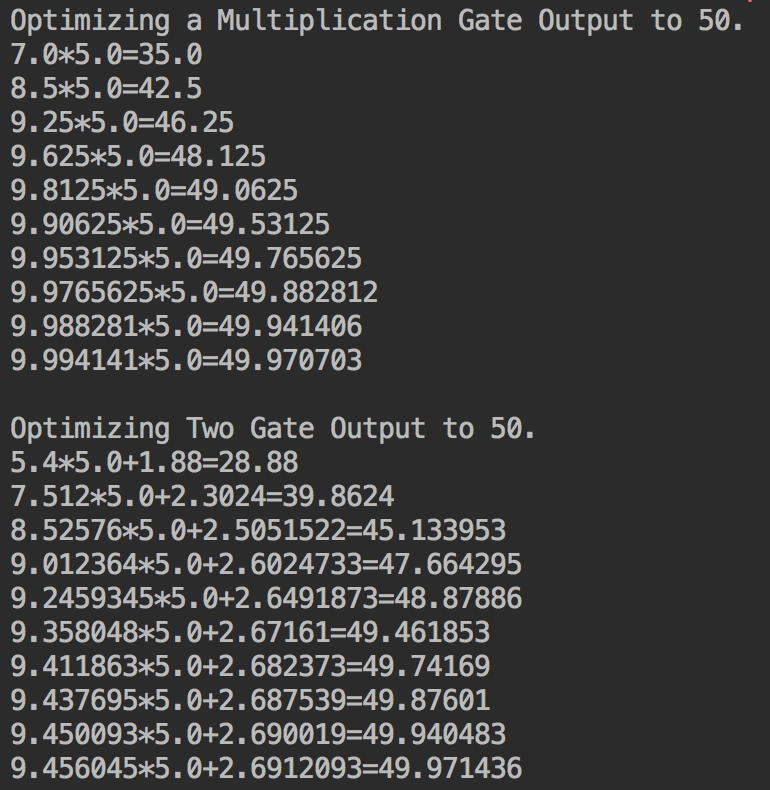
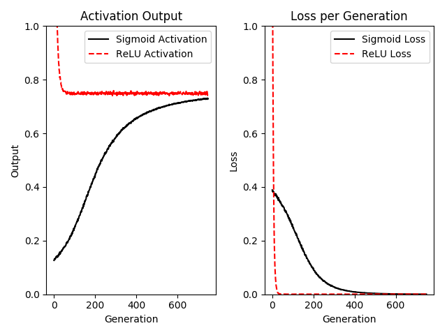
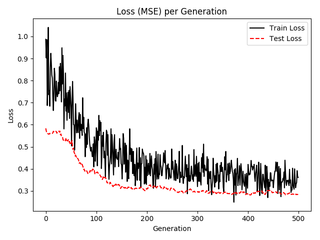

## Chapter 6 Nerual Network

* **Implement Operational Gates**

The first operational gate we will implement looks like f(x)=ax. And the second operational gate will be f(x)=ax+b. Here a and b are varables, and x is a placeholder. We optimize the output toward the target value of 50, which means tensorflow will try to change the a and b values instead of x value. In the second example, the solution is not unique as there are diffferent comnination od model variables. 

And here are the training variables' values:

* **Working with Gates and Activation Functions**

As we could link together operational gates, here we will try to run the computational graph output through an activation function. And we mention 2 activations, the sigmoid and the rectified linear unit(ReLU). So we create 2 one-layer neural network with the same structure except one feed through the sigmoid activation and one will feed through the ReLU activation. The loss function is the L2 distance from the value 0.75. The data will be randomly selected from a normal distribution(N(2,0.1)).  

Here are the Activation output and loss values of 2 neural networks during the training:

* **Implement a One-Layer Neural Network**

Here is a one-layer neural network that operates on the iris dataset. In the problem, we use the pedal length as the target value. So it is a regression problem. 

The following is the loss during the training:

Note: In the book, the author set the hidden layer to have 5 nodes, which should be not enough to fit the regression variables. When I change it to 10, to some extent, the underfitting was eliminated.
