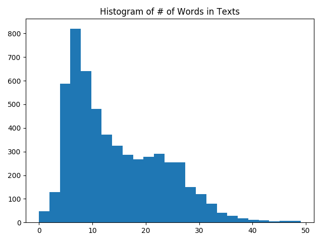

## Chapter 7 Natural Language Processing

* Working with bag of words

In the recipe, the code shows how to work with a bag of words embedding in TensorFLow. We will use this type of embedding to do spam prediction.

Here is the histogram of Words in Text:

