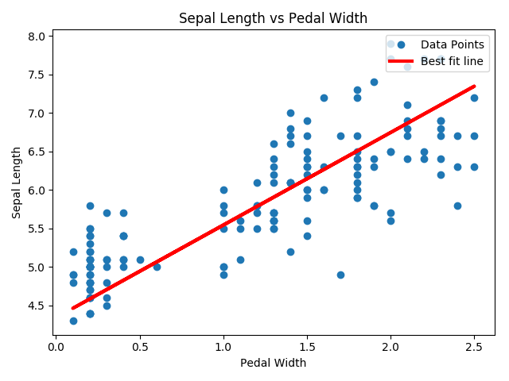
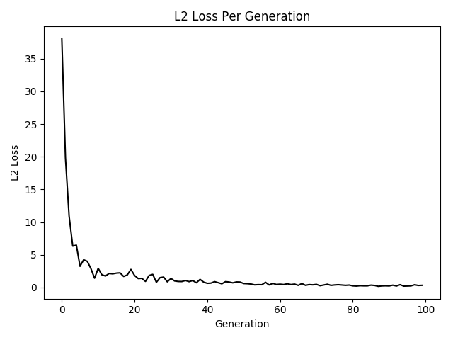
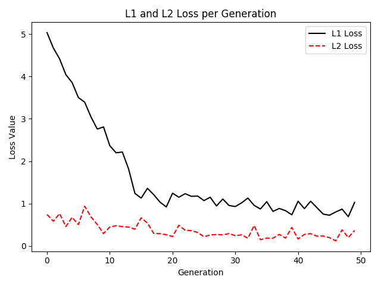
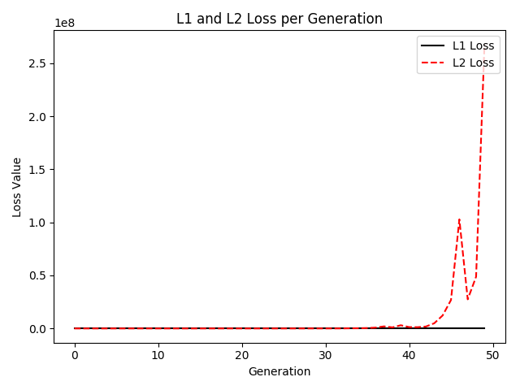
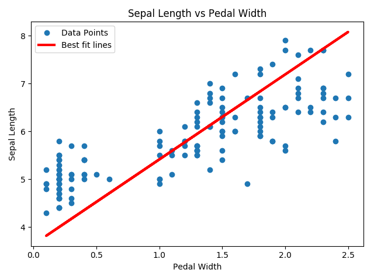
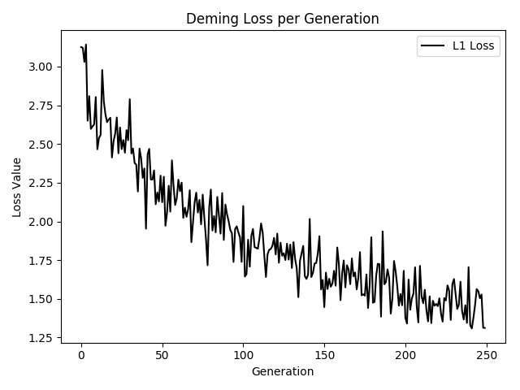
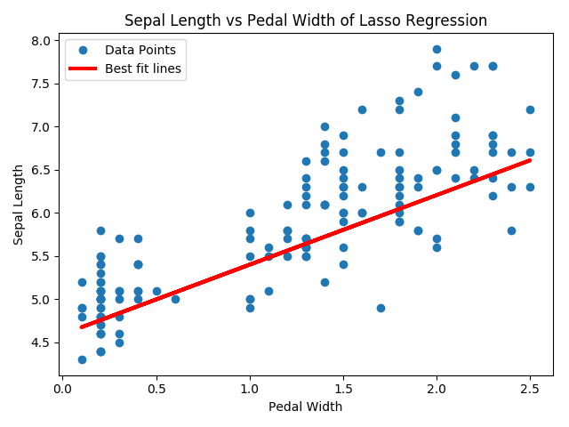
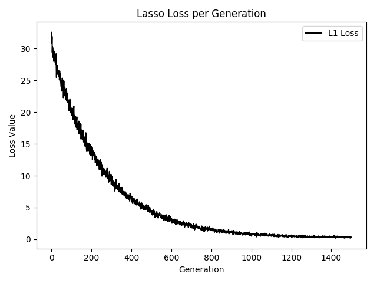

# TensorflowML
All examples of python are from 《**TensorFlow Machine Learning Cookbook**》.
## Chapter 1: Getting Started with TensorFlow

* Declaring Tensors
* Using Placeholders and Variables
* Working with Matrices
* Implementing Activation Functions

## Chapter 2: The TensorFlow Way 

* Operating in a Computational Graph
* Layering Nested Operations
* Working with Multiple Layers
* Implementing **Loss Functions**
* Implementing **Back Propagation**
* Working with **Batch and Stochastic Training**  
Extend the prior regression example using stochastic training to batch training. Stocahstic training is only putting through one randomly sampled data-target pair at a time. Batch training is putting a large protion of the training examples in at a time and average the loss for the gradient calculation.In stochastic training, randomness may help move out of local minimums. But it needs more iterations to converge. However, batch training finds minimums quicker and takes more resources to compute.  

Here's the loss vaules during the two training process.  
   
* Combining Everything Together  

We create a classifier on the iris dataset by combining everything together. It's a binary classifier to predict whether a flower is the species Iris setosa or not. Here we define the linear model. The model will take the form ***x2=x1\*A+b***. And if we want to find points above or below that line, we see whether they are above or below zore when plugged into the equation ***x2-x1\*A-b***.  

Here is the figure for the problem.  

* **Evaluating Models**  
Here is that we visualize the model and data with two separate histograms using matplotlib:
 

## Chapter 3: Linear Regression
* Using the **matrix inverse method**  

When ***Ax=b***,the solution to solving ***x*** can be expressed as ***x=(ATA)-1ATb***.  

The plot image that the linear regression produces will be:
   

* Imlementing a **Decomposition Method**  

We implement a matrix decomposition method for linear method. Implementing inverse methods in the previous recipe can be numerically inefficient in most cases, especially when the matrices get cery large. Another approach is to use the **Cholesky decomposition method**. The Cholesky decomposition decomposes a mtrix into a lower and upper triangular matrix, say ***L*** and ***L'*** , such that these matrices are transposition of each other. Here we solve the system, ***Ax=b***, by writing it as ***LL'x=b***. We will first solve ***Ly=b*** and then solve ***L'x=y*** to arrive at our coefficient matrix ,***x***.  

And the following image shows the result.  

  

* The TensorFlow Way of Linear Regression  

Loop through batches of data points and let TensorFlow update the slopes and y-intercept. We will find an optional line through data points where the x-value is the petal width and the y-value is the sepal length. In the end, we plot the best fit line and data points image. And we plot the L2 loss vs generation image.  

Here are the images.  

  

  

* Understanding Loss Function in Linear Regression  

We use the same irirs dataset as in the prior recipe, but we will change our loss functions and learning rates to see how convergence changes.

When the learning rate is 0.1, the loss values will change with following trend:  

  

However, when the learning rate is 0.4, the model will not converge:   

   

* Implement Deming regression

In the recipe, we will implement Deming regression, which means we will need a different way to measure the distance between the model line and data points.  

Here are the best fit line and data points:  

  

And the following is the loss values during the training:  

  

* Implement Lasso and Ridge Regression  

There are also ways to limit the influence of coefficients on the regression output. These methods are called regularization methods and two of the most common regularization mathods are lasso and ridge regression. We add regularization terms to limit the slopes in the formula.

For lasso regression, we must add a term that greatly increases our loss function if the slope, A, gets above a certain value. We use a continuous approximation to a step function, called the continuous heavy step function, that is scaled up and over to the regularization cut off we choose.  

Here are the results of fit line and Loss value during the training:  

  

  

For ridge regression, we just ass a term to the L2 norm, which is the scaled L2 norm of the slope coefficient.