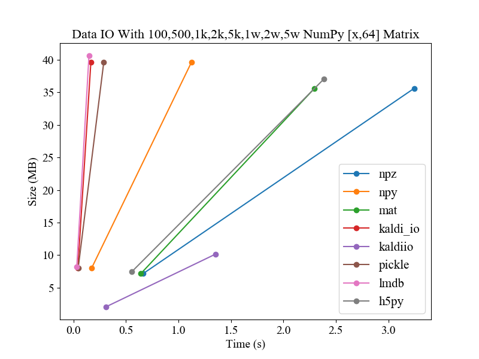

## Tensorflow ML
All examples of python are from 《**TensorFlow Machine Learning Cookbook**》.  

- Chapter 1: Getting Started with TensorFlow

- Chapter 2: The TensorFlow Way 

- Chapter 3: Linear Regression  

- Chapter 4: Support Vector Machines

- Chapter 5: Nearest Neighbor Methods

- Chapter 6: Neural Networks

- Chapter 7 Natural Language Processing

## Other Python

### NumPy Matrix Storage IO

Compared the following methods for storing and reading matrix in PythonProgramDesign/IOTest/mat_io_speed.py:

- h5py
- lmdb
- npz
- pickle
- kaldiio
- npy
- mat
- kalid_io

